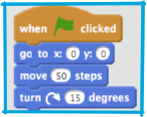
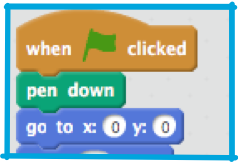
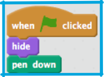
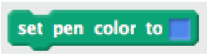
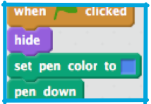
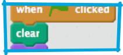

1. Now you’ve learned the basics of Scratch (and if you haven’t, check out the Beginner Scratch Sushi Cards) and made your first Scratch game. In this series you’re going to learn a few more cool tricks and make one of my favourite Scratch projects: It draws colourful patterns and, if you set it up right, can be really cool to watch. 

 It all relies on the **pen** tool, which is controlled by blocks in the **pen** group. These blocks draw a line behind the centre of a sprite as it moves. You’re going to learn to use it now!

 Start a new Scratch file, select the Scratch Cat **sprite** and drag in a few of the blocks you’re familiar with from the beginner cards, until it looks like this: 

2. Cool! Now, time to test out the pen! From the **pen** section, select the `"pen down`" block and add it to the start of your program, like this: 

 Now click the green flag a few times and watch what happens!

3. If you can see the lines behind the cat then the pen is working and you can start making it draw really cool patterns!

 First, you should get rid of the cat! It’s getting in the way of the drawing! Just add a `"hide"` block from **looks** to the start of the program and it’ll disappear. 

4. Now, you can change the colour of the pen with another block from the pen section, but this block is a little different to the others you’ve seen. It’s the `"set pen color to "` block and looks like this: 

 Drag one out onto your **sprite panel** and snap it in ahead of the `"pen down"` block. 

 Now, click on the box of colour (in the code above it’s the blue one) and you’ll see the mouse pointer turn into a hand. Move it around the screen and notice how the colour in the box changes to be the colour of whatever is underneath the pointer! When you click, Scratch will save that colour as the colour of your pen.

5. If you’ve been clicking on the green flag to test your code, you’ll have noticed that the drawings made by the pen don’t go away. Add a `"clear"` block from the **pen** section to the start of your code to take care of that! 

