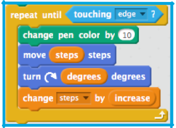
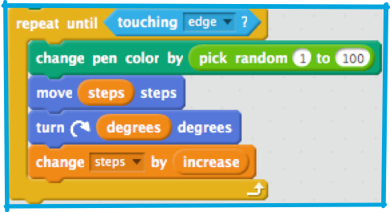

1. Time to add colour! Right now, your line is one colour, but the **pen** has blocks that can change its colour. With the right **operator** blocks, you can change it randomly.

 The colour changing block you’re looking for is `"change pen color by "`: 

 Grab one of those and put it into your `"repeat until"` loop, like this: 

2. That’s cool, but a bit predictable. You can make it a bit more fun if you add a random number into it, so the colour changes randomly. Just put the random number operator into the `"change pen color by "` block and pick some values to go in it. I'd try 1 and 100 to start. 

 Try running it again, watch the random rainbow!

3. You can actually use random numbers to make the whole program run itself over and over, changing the pattern each time! It'll look a bit like screen savers did in the 1990s... which you won't remember, but ask one of your Dojo Mentors!

 You need a few changes to make this happen. The first one is that you need to set the "increase" and "degrees" variables randomly, rather than asking for them from the user. So you need to change some of your code blocks: 

4. If you run that, you’ll find that the program does draw randomly, but only once. Why do you think that is?

 It’s because the loop only runs until it reaches the edge of the **stage**. You need another loop, that runs forever (so a `"forever"` block then!) outside the current one to keep it going over and over! Just drag one out of **control** and wrap your code in it. 

